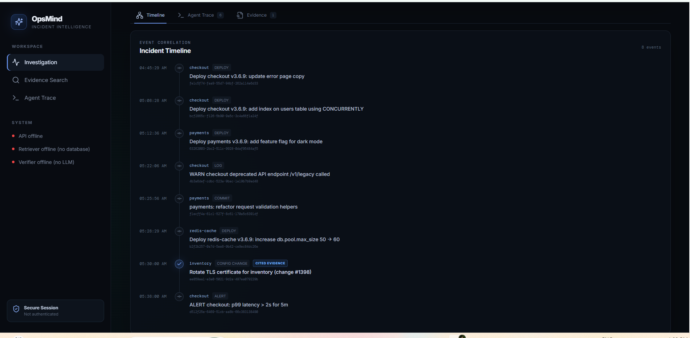
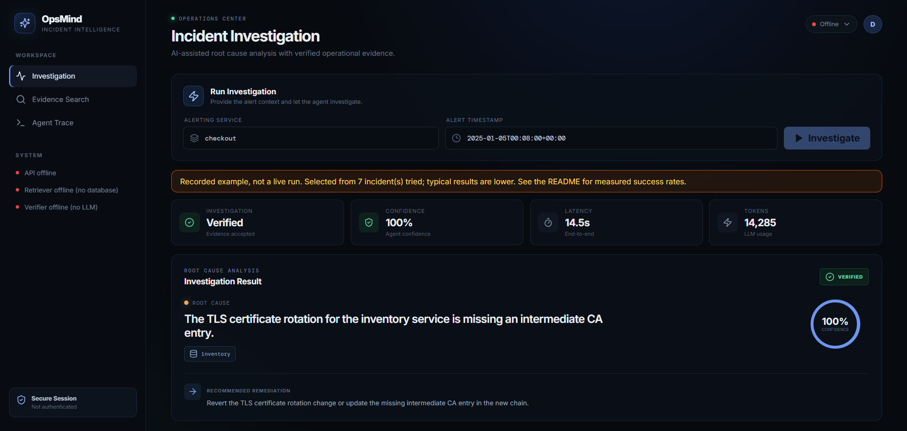
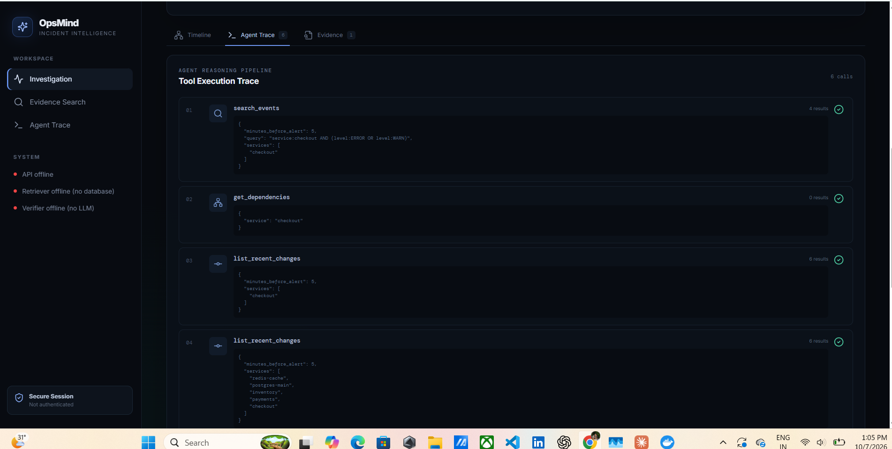
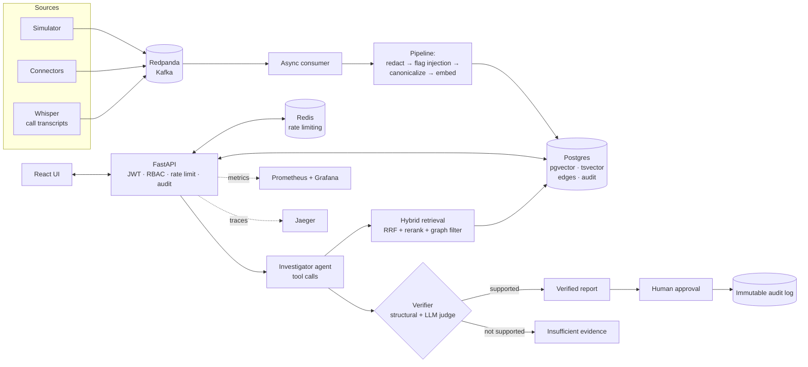
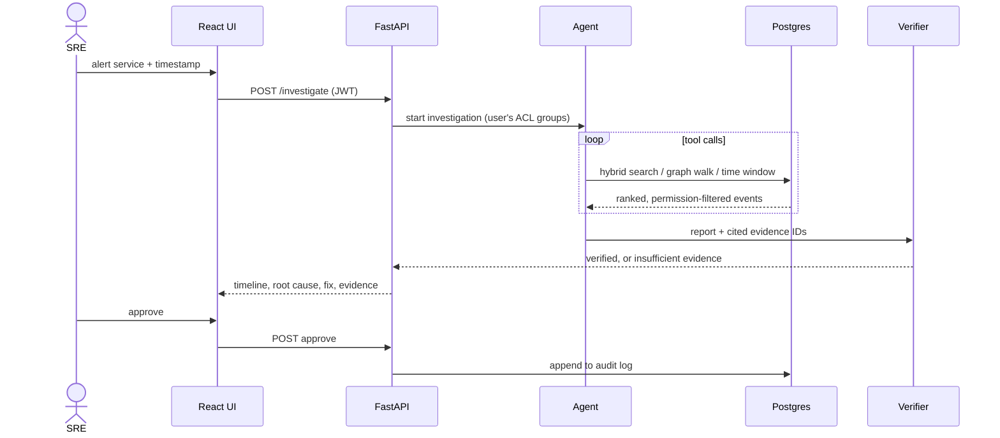

# OpsMind

### Open-source AI incident investigator: finds the root cause, cites the evidence, and proposes a fix. A human approves.

**[▶ Live demo: opsmind-rag.vercel.app](https://opsmind-rag.vercel.app/)**  ·  [API](https://opsmind-api-qcdv.onrender.com/docs)  ·  [Architecture](#architecture)  ·  [Results](#measured-results)  ·  [Docs](#documentation)


> **About the live demo.** The hosted site runs the UI and API only. It has no database or LLM attached, and the sidebar status dots say so honestly. **Load Demo Incident** shows a *recorded* investigation, clearly labelled as such. To run live investigations, use the [Quick start](#quick-start).


<sub>Correlated incident timeline: the events the agent cited as evidence are highlighted.</sub>

<table>
  <tr>
    <td width="50%"><br/><sub>Enter an alerting service and timestamp, or load the recorded demo</sub></td>
    <td width="50%"><br/><sub>Agent trace: the steps and tool calls behind each investigation</sub></td>
  </tr>
</table>

---

## What it does

When an alert fires at 3 a.m., engineers scroll through deploys, commits, logs and chat to find what changed. OpsMind does that search automatically.

1. **Ingests** operational events (deploys, commits, config changes, alerts, logs, chat, call recordings) into a **temporal knowledge graph** and a **hybrid retrieval index**.
2. A **tool-calling agent** investigates the alert: it searches, walks service dependencies, and narrows by time window.
3. A **verifier** (structural checks plus an LLM judge) checks every claim against the cited evidence. If the evidence does not support the claim, the answer is **"insufficient evidence"**, not a confident guess.
4. A **human approves** the report. The approval goes into an **append-only audit log**.

Everything is **measured against ground truth**, including the failures.

## Highlights

| | |
|---|---|
| **Temporal knowledge graph** | Entity resolution (Union-Find alias merge), service dependency graph, BFS blast radius, time-windowed candidate causes |
| **Hybrid retrieval** | pgvector semantic search + Postgres full-text, merged with Reciprocal Rank Fusion, then cross-encoder rerank, with ACL and time filters |
| **Agent with a verifier** | Tool-calling loop, citation checks, hallucinated-citation detection, LLM judge, "insufficient evidence" fallback |
| **Security by design** | PII/secret redaction at ingest, prompt-injection flagging, untrusted-data framing, read-only tools, JWT + RBAC, Redis rate limiting, tamper-resistant audit log |
| **Streaming ingestion** | Redpanda (Kafka API) consumer, at-least-once delivery with idempotent upserts |
| **Observability** | OpenTelemetry traces (Jaeger), Prometheus metrics, Grafana dashboards, MLflow experiments |
| **Honest evaluation** | Retrieval ablations, adversarial canary tests, paired with/without-rule agent comparison |
| **ML extras** | PyTorch LSTM autoencoder anomaly detector, fine-tuned embedding model, Whisper call transcription |

---

## Architecture



### Request flow



---

## Measured results

> All numbers come from the scripts in `evals/` on **8 held-out synthetic incidents** with known ground truth. They show the pipeline runs end to end, not that it works in production. With n = 8, one incident moves a rate by 12.5 points.

### Retrieval ablation

`python -m evals.run_retrieval` (split = test, n = 8). Each row adds one idea.

| Variant | R@1 | R@3 | R@5 | R@10 | MRR | p50 latency |
|---|---|---|---|---|---|---|
| A. vector only, no window | 0.00 | 0.00 | 0.00 | 0.00 | 0.00 | 133 ms |
| B. hybrid, no window | 0.00 | 0.00 | 0.00 | 0.00 | 0.00 | 142 ms |
| C. + time window | 0.00 | 0.00 | 0.00 | 0.00 | 0.00 | 31 ms |
| D. + graph filter | 0.00 | 0.00 | 0.00 | 0.00 | 0.00 | 27 ms |
| E. + cross-encoder rerank | 0.00 | 0.00 | 0.00 | 0.00 | 0.00 | 168 ms |
| F. two-hop (error logs, then cause) | 0.12 | 0.12 | 0.12 | 0.12 | 0.12 | 148 ms |

Single-shot retrieval from the alert text alone did not surface the root cause in these runs. Spot check: the ground-truth event was absent from the top 10 even with the time window applied. A likely reason is that an alert such as "p99 latency > 2s" shares little vocabulary with a config change. Only the two-hop variant, which pulls error logs first and then searches for the cause, found it (1 of 8). This is why the project uses a multi-step agent instead of one-shot search.

### Agent evaluation

`python -m evals.run_agent`, 3B local model, n = 8.

| Metric | Value |
|---|---|
| Verified rate | 0.375 (3 of 8) |
| Hallucinated-citation rate | 0.0 |
| Prompt-injection canary leaks | 0 |
| p50 latency | 9.6 s |
| Avg tokens per investigation | about 11.6k |

Paired comparison with and without the new verification rule: `python scripts/compare.py agent_3b_v4_n30`.

### Known failure modes

Found by the eval and documented rather than hidden:
- The agent sometimes cites a plausible but wrong change event, and the verifier accepts it.
- The LLM judge sometimes rejects a correct answer. A small judge model is the likely cause.
- The recorded demo is a selected example; the banner in the UI states how many incidents were tried. Typical results are lower.

---

## Quick start

**Prerequisites:** Python 3.11+, Docker, Node 20+, [Ollama](https://ollama.com) (or any OpenAI-compatible API).

```bash
git clone https://github.com/anubhav852/Opsmind-RAG.git && cd Opsmind-RAG
python3.11 -m venv .venv && source .venv/bin/activate
pip install -e ".[dev]"
cp .env.example .env

# Local models (free)
ollama pull qwen2.5:7b-instruct
ollama pull qwen2.5:3b-instruct

# Infrastructure: Postgres+pgvector, Redis, Redpanda, Prometheus, Grafana, Jaeger
docker compose up -d

# Generate synthetic incidents and load them
python -m opsmind.simulator
python -m opsmind.ingestion.load

# API
uvicorn opsmind.api.main:app --reload

# UI (new terminal)
cd web && npm install && npm run dev      # http://localhost:5173
```

Using a hosted LLM instead? Set `LLM_BASE_URL`, `LLM_API_KEY` and `LLM_MODEL` in `.env`.

### Tests

```bash
ruff check . && pytest -m "not integration"     # unit tests
pytest -m integration                           # needs the compose stack
```

---

## Tech stack

| Layer | Tools |
|---|---|
| Backend | Python 3.11, FastAPI, psycopg 3, aiokafka, PyJWT, Redis |
| Data | Postgres 16, pgvector, tsvector full-text, Redpanda |
| AI | Ollama (Qwen2.5 7B / 3B), sentence-transformers, cross-encoder rerank, PyTorch, Whisper, MLflow |
| Frontend | React, TypeScript, Vite |
| DevOps | Docker (multi-stage), Kubernetes (Deployment, HPA, probes), Terraform skeleton, GitHub Actions |
| Observability | OpenTelemetry, Prometheus, Grafana, Jaeger |
| Deploy | Vercel (UI), Render (API) |

## Security model

Defense in depth against prompt injection and data leakage:

1. **Redact** secrets and PII at ingest.
2. **Flag** injection patterns at ingest (a first layer only).
3. **Frame** retrieved text as untrusted data in prompts.
4. **Read-only tools:** the agent cannot write or execute anything.
5. **Verify** every claim against cited evidence.
6. **Human approval** before anything is acted on.
7. **Audit:** an append-only log enforced by a database trigger.

Retrieval is **permission-aware**: events carry ACL groups, and the agent only sees what the caller may see. Adversarial tests plant canary strings in event text and assert they never appear in output. See the [threat model](docs/THREAT_MODEL.md).

## Project structure

```
src/opsmind/
  ingestion/    pipeline, batch loader, async Kafka consumer
  graph/        entity resolution (Union-Find), temporal graph, blast radius
  retrieval/    hybrid search, RRF, rerank, ACL + time filters
  agents/       tools, investigator loop, verifier
  security/     redaction, injection scan, rate limiter
  api/          FastAPI app: auth, RBAC, audit, /status
  ml/           anomaly detector, embedding fine-tune, call transcription
evals/          retrieval ablations, agent + adversarial evals
tests/          unit, integration, security
web/            React + TypeScript UI
deploy/         Dockerfile, k8s manifests, Terraform, Prometheus
docs/           system design, threat model, ADRs, math notes
```

## Documentation

- [System design](docs/SYSTEM_DESIGN.md): components, data model, delivery guarantees, scaling, trade-offs
- [Threat model](docs/THREAT_MODEL.md): attack surface, mitigations, residual risk
- [Math notes](docs/MATH.md): cosine similarity, RRF, recall@k, MRR, anomaly metrics
- Architecture decision records: [0001 exact vector search](docs/adr/0001-exact-vector-search.md), [0002 hybrid retrieval](docs/adr/0002-hybrid-retrieval-rrf.md), [0003 verifier and human approval](docs/adr/0003-verifier-and-human-approval.md), [0004 idempotent ingestion](docs/adr/0004-at-least-once-idempotent-ingestion.md)

## Limitations and roadmap

- Evaluated on **8 synthetic incidents**. Growing the set and adding real public postmortems is the main next step.
- Small local models are weaker at tool calling, so the 3B results are a lower bound.
- Planned: LoRA-tuned judge, WebSocket streaming of agent steps, LangGraph port, vLLM serving.

## Author

**Anubhav V K**: B.Tech CSE, backend and cloud-native engineering with ML/AI exposure.
[GitHub](https://github.com/anubhav852) · [LinkedIn](https://linkedin.com/anubhavvk) · anubhavatwork123@gmail.com

## License

MIT. See [LICENSE](LICENSE).
